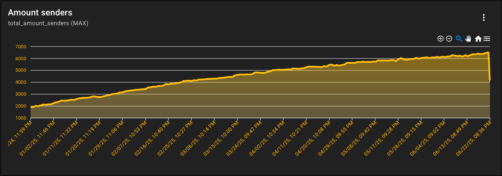

---
authors:
  - name: Oliver Schlüter
    email: oliver@fancyinnovations.com
    link: https://github.com/OliverSchlueter
    avatar: https://avatars.githubusercontent.com/u/79666085?v=4

date: 2025-06-21
title: "FancyAnalytics Dev Log #1"
description:  "The rewrite of FancyAnalytics is underway! In this first dev log, we will take a look at the current state of the backend."
---

## State of the platform

Let's start by looking at the numbers. There are **46** registered users and **40** users are still on the waiting list.
On the discord server, there are **277** members having the FancyAnalytics role.
In total, there are 52 projects, but only a handful of them receive continuous data.
The **1018** metrics are being visualized in **98** dashboards, which include **872** charts.

There are **1.28** million recorded data points. One data point contains values for all metrics of a project at a specific time.
The total number of errors is **715k**, and the total number of events is **497k** with **60** different event types.

*(In March, I added an compression algorithm, which reduced the number of the data points by about **70%**.)*

FancyAnalytics receives data from **6300 to 6700** unique clients per day, with a total of **18.4 million** requests per day.

I think these numbers are quite impressive for a project that is still in beta and has almost no marketing.

Now let's take a look at the current tech stack and architecture of FancyAnalytics.
The backend is written in Java and uses the lightweight framework [Javalin](https://javalin.io/) for the webserver.
The website is made with Vue.js and [Vuetify](https://vuetifyjs.com/en/) (component library).
There is one generic Java SDK and one SDK for Minecraft plugins. FancyAnalytics also provides a plugin for the Minecraft server software Paper.
All data is stored in MongoDB and Redis is used for caching.

Two servers are used to run the backend. 
On the first server, the main backend and all databases are running.
There are two instances running on the second server.
All instances of the backend receive data from the clients and cache them in Redis.
The main instance is then responsible for aggregating the data and writing it to MongoDB.
Nginx is used as a reverse proxy to route the requests to the correct instance.
There is also a backup instance that is used to handle the requests if all other instances are down.
It just response with 200 OK and does not write any data to the database.

## The problems with the current architecture

### Scalability

Since javalin is already a lightweight framework, it still uses a lot of memory (around 2 GB per instance). 
There is only one backend, and you can toggle certain capabilities on and off using environment variables.
This works but it is not very flexible and does not allow for easy scaling.

Using MongoDB for analytical data is not ideal, as it is not optimized for querying and inserting large amounts of data - even with indexes.
The flexibility of MongoDB is great for the general business data, but it is not suitable for analytical data.
There are databases that are specifically designed for analytical data, such as DuckDB or ClickHouse.

### Performance

The API has few query capabilities, which makes it hard to get the data you really want. 
You need to fetch all data and then filter it on the client side (e.g., 6 kb response but only using one data point).

Let's imagine a Minecraft server with the following plugins:
- FancyAnalytics
- FancyNpcs
- FancyHolograms
- FancyDialogs

Each plugin sends analytical data to FancyAnalytics, every 30 seconds. That means eight requests per minute just from this server.
These requests can be combined into one request every 30 seconds, containing all data from all plugins.

## What to expect in the future

I'm currently working on a complete rewrite of the backend, which will address all the problems mentioned above.
There will be 6 different services, each responsible for a specific tasks.
No more Java, the backend will be completely written in **GoLang**.

### Collector

The collector is only responsible for receiving data from the clients and handing it to the ingestor.
It will forward the data to the ingestor via a message queue (NATS).
That means even when the ingestor is down, the collector can still receive data and will not lose any data.
There will be multiple collector instances running, to handle the load.

### Ingestor

The ingestor is responsible for processing the data received from the collector and writing it to the database.
It will also handle the aggregation of the data and write it to the analytical database.
The ingestor has no public API and is only used by the collector.

### Core

The core service will handle the business logic of FancyAnalytics. It is basically the old backend, but rewritten to be more modular and scalable.
It's responsible for managing the projects, dashboards, metrics, queries ...

### IDP (Identity Provider)

The IDP will handle everything related to user management, authentication, and authorization.
The current system only allows for username/password authentication, but the new IDP will support multiple authentication methods, such as "login with Google".
Access tokens will be reworked to be more performant and flexible.
The IDP will also handle email verification and password reset.

### Website

The website backend service will be responsible for serving the website and further docs in the future.

### Router

I'm replacing Nginx with a custom router service, which will route the requests to the correct service.
It supports load balancing and can route the requests based on the URL.

### Databases

We will still use MongoDB for the business data, but we will switch to DuckDB or ClickHouse for the analytical data.
These are OLAP databases that are specifically designed for analytical queries and can handle large amounts of data efficiently.
We will also use Redis for caching and use NATS as a message queue to decouple the services and make them more scalable.

## Coming features

Soon you will be able to store **logs** in FancyAnalytics, which will allow you to track errors and other log messages from your applications.
This is great for debugging and monitoring your applications.

**Alerts** is a highly requested feature, which will allow you to set up alerts based on certain conditions.
You can set up alerts for when a metric exceeds a certain threshold or when an error occurs.
You will be able to receive notifications via email, Discord, or other channels.

Another highly requested feature is **public dashboards**, which will allow you to share your dashboards with others (read-only).
This is great for sharing your analytics with your team or the public.
This feature will also include the ability to embed the dashboards or single charts in other websites.

**Templates** are another feature that will allow you to easily create dashboards and charts.
A template contains a set of metrics and predefined dashboards that can be used to quickly set up a project.
Example templates could be:
- Minecraft server template: Contains metrics for player count, TPS, and plugin usage
- Minecraft plugin template: Contains metrics for plugin usage, server software and version
- Discord bot template: Contains metrics for server count, user count, and message count
- General Java application template: Contains metrics for memory usage, CPU usage, and garbage collection
- Web application template: Contains metrics for page views, user sessions, and errors

FancyAnalytics is not only for Minecraft related projects, but can be used anywhere.
In addition to the Java SDK, we will also provide a **Go and JavaScript SDK**.
The Go SDK will be used for the backend services, while the JavaScript SDK will be used for web applications.

## Conclusion

The rewrite of FancyAnalytics is a big step forward and will address all the problems we have with the current architecture.
I'm excited to see how the new architecture will improve the performance and scalability of FancyAnalytics.
It will still take some time until the new architecture is ready, but I will keep you updated on the progress.

Thank you to everyone who already uses FancyAnalytics and provides feedback. I'm looking forward to accept more users after the rewrite is finished.

If you have any questions or suggestions, feel free to join the [Discord server](https://discord.gg/ZUgYCEJUEx) or dm me on Discord (real_oliver).

_Oliver_