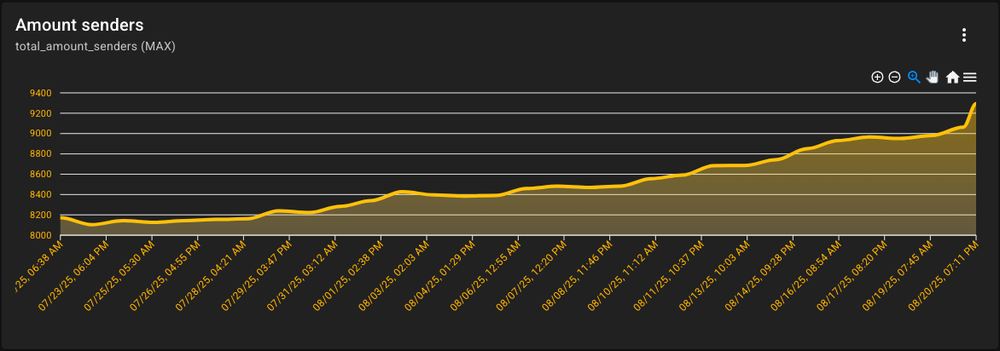
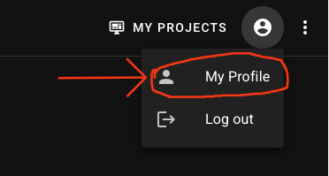

---
authors:
  - name: Oliver Schlüter
    email: oliver@fancyinnovations.com
    link: https://github.com/OliverSchlueter
    avatar: https://avatars.githubusercontent.com/u/79666085?v=4

date: 2025-08-20
title: "FancyAnalytics Dev Log #2"
description:  "We're getting closer to v1 of FancyAnalytics!"
---


## Some numbers

Let's start by looking at some numbers, which have changed since the last dev log. 
There are +30 new users on the waiting list, bringing the total to **70** users on the list.
This is a good sign that people are interested in FancyAnalytics and want to use it.

The number of recorded data points has increased to **1.4 million** and the total number of errors is now **1 million**.
The total number of events is now **0.7 million** with **69** different event types.

FancyAnalytics now receives data from about **9500** unique clients per day (+ 46% :O), with a total of **27.4 million** incoming requests per day.



It's impressive to see how FancyAnalytics is growing, even without any marketing.

## Check your email address!

Some of you have no email address set in your profile. A valid email address is required to use v1 of FancyAnalytics, once it is released.

Please check your profile and set a valid email address. You can do this in the profile page of the website.



You can only set your email address if it's not a valid email address. 
In the first few months of the beta phase, I manually created accounts for users who wanted to try FancyAnalytics and used their Discord username as the email address.
So everyone has to set their email address manually before v1 is released!

## The new API

### Metrics

In FancyAnalytics v1, metrics will become way more powerful and flexible. 
The first decision you have to make is whether your metric is a **pull-based** or **push-based** metric.
The key difference is who is responsible for sending the metric data to the FancyAnalytics API.:
- **Push-based**: the client (e.g. Minecraft server) proactively sends the metric data to the FancyAnalytics API every X seconds.
- **Pull-based**: FancyAnalytics will request the metric data from the client every X seconds.

When your metric is a pull-based metric, you can define the endpoint (e.g. `https://minecraftserver.com/metrics`) and the interval (in seconds) at which FancyAnalytics should request the data.

If your metric is a push-based metric, you need to decide whether it's a **multi-sender** or **single-sender** metric.
As the name suggests, a multi-sender metric can be sent by multiple clients (e.g., everyone who uses your Minecraft plugin) at the same time, while a single-sender metric can only be sent by one client at a time (your personal Minecraft server).
If you choose a multi-sender metric, you can set the aggregation interval (in seconds) at which FancyAnalytics should aggregate the data from all clients.
You can also choose to apply extra aggregation functions to the data, such as `sum`, `avg`, `min`, `max`, and `count`.

Currently, the structure of a metric looks like this:

```json
{
  "project_id": "FancyNpcs",
  "metric_id": "npc_count",
  "name": "NPC Count",
  
  "multi_sender": true,
  "aggregation_interval": 300,
  "apply_extra_aggregation": true,
  
  "pull_metric": false,
  "pull_interval": 0,
  "pull_url": ""
}
```

### Metric data

The data structure of a metric data point has also changed. Metrics now **only** support numeric values, which can be either an integer or a floating point.
You can now group metric data points by **labels**, which is the alternative to the string-based metrics. You can think of labels as "sub-metrics" that can be used to differentiate between different data points of the same metric.
The label field is optional, so you can still send a metric without labels.

The new data structure looks like this:

```json
{
  "sender_id": "sender-1",
  "project_id": "FancyNpcs",
  "data": [
    {
      "metric": "npc_types",
      "label": "player",
      "value": 40.0
    },
    {
      "metric": "npc_types",
      "label": "cow",
      "value": 10.0
    },
    {
      "metric": "npc_actions",
      "value": 123
    }
  ]
}
```

## Identity Provider

Since the last dev log, I have also made some progress on the identity provider (idp) service.

The idp service is responsible for user authentication and identity management. It will handle two central tasks:
- **User management**: Registration, login, password management, verification, roles, custom metadata, etc.
- **Token management**: Creating, refreshing, and validating tokens for authenticated users

The user management part is almost completely implemented and works well. Only OCID user registration (sign in via Google, GitHub or Discord) and the forgot password flow are still missing.

The token management part is already implemented and works well, too. It now uses JWT tokens, which are more secure and easier to use than the previous token system.

I still need to figure out a way to prevent brute force attacks on the login endpoint and implement rate limiting for the API.
If you have any suggestions on how to implement this, feel free to join the [Discord server](https://discord.gg/ZUgYCEJUEx) and let me know :D

## Next steps

The next step for FancyAnalytics is to finish the idp service and make user management available in the new web interface (a dedicated dev log about the new UI will follow).
After that, I will focus on the core service and UI, which will be the main part of FancyAnalytics v1.

## Conclusion

FancyAnalytics is making great progress and is getting closer to the v1 release.
I still can't give you a specific date for the release, as I still have a lot of work to do, but I hope you are as excited as I am about the upcoming features and improvements.

Thank you for your continued support and interest in FancyAnalytics!

You can still join the [waiting list](https://fancyanalytics.net/register/) and get access to the beta version once it's available.

If you have any questions or suggestions, feel free to join the [Discord server](https://discord.gg/ZUgYCEJUEx) or dm me on Discord (real_oliver).

_Oliver_