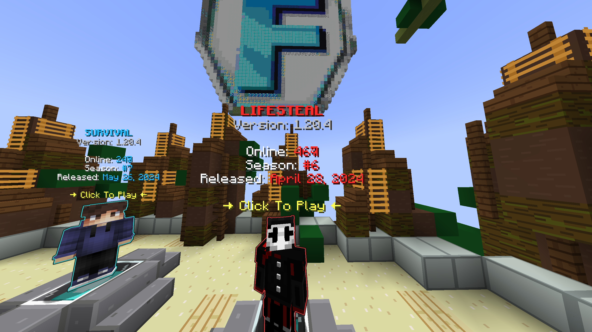
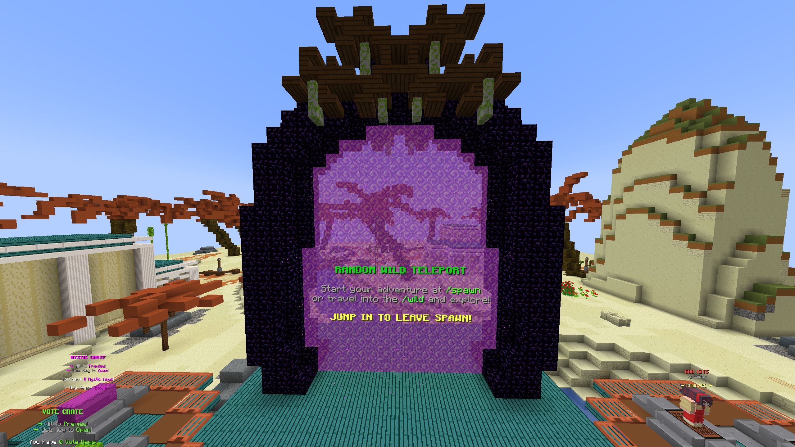
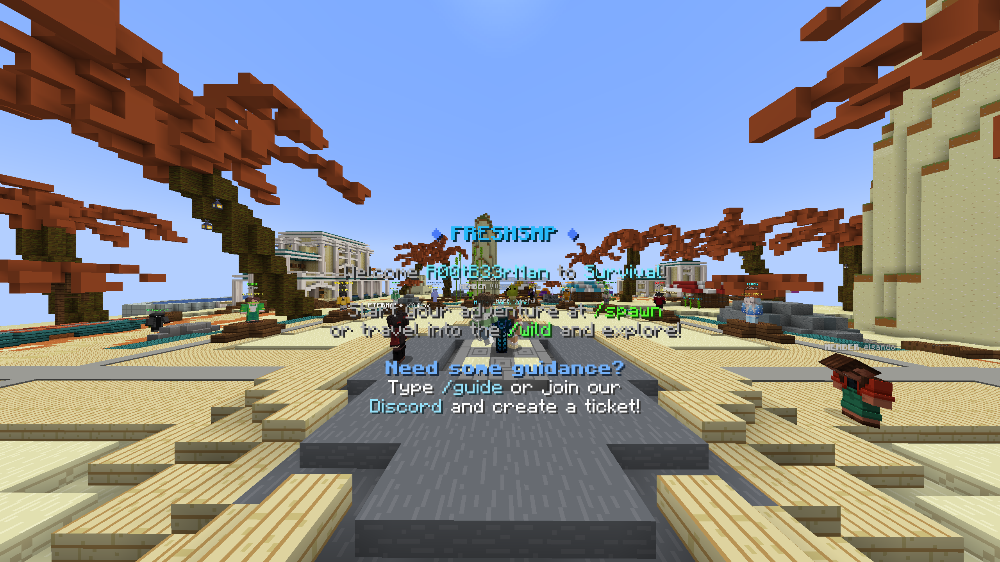
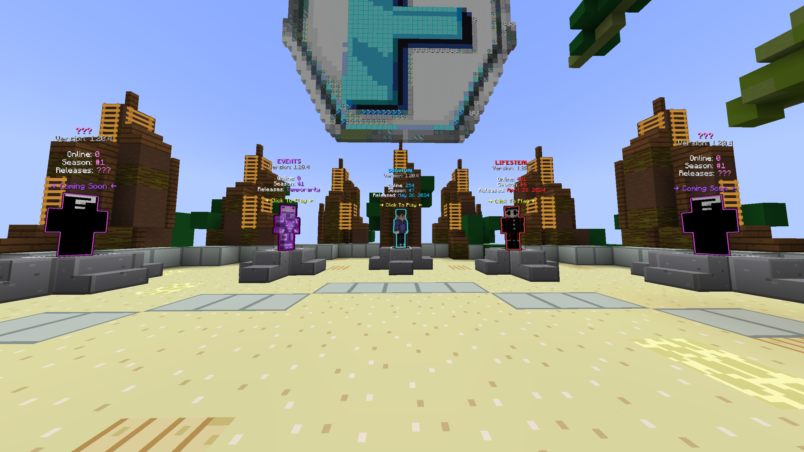
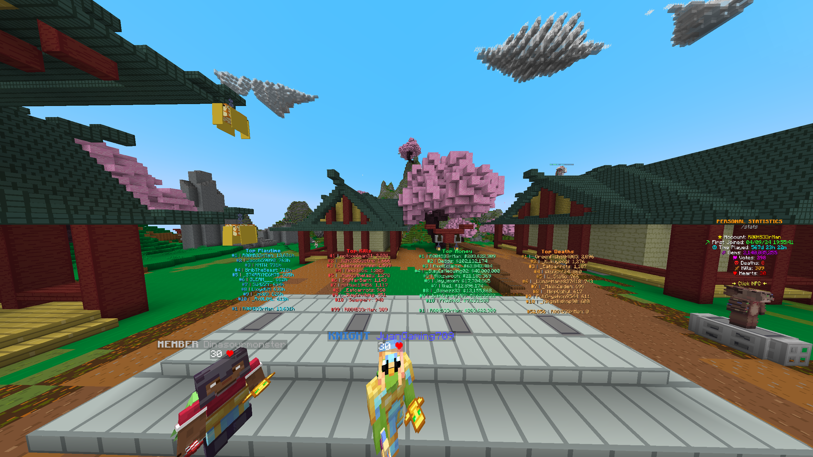
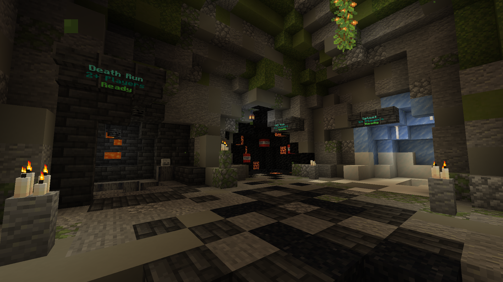
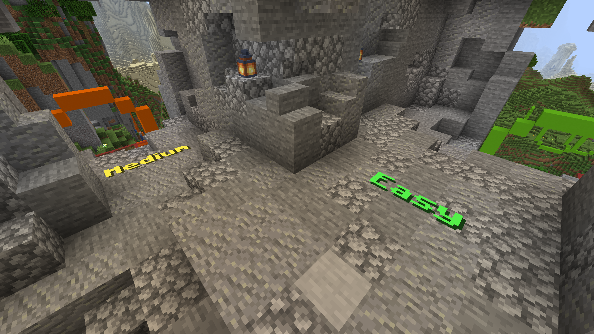

# Inspiration

The following examples show how to use FancyNpcs in different ways. They are meant to give you an idea of what you can do with the plugin.

Almost all examples are made by the community. If you have a nice example that you want to share, feel free come to our discord server and show it to us.

