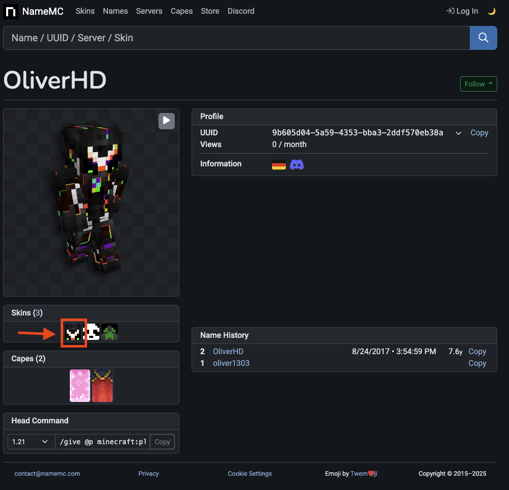
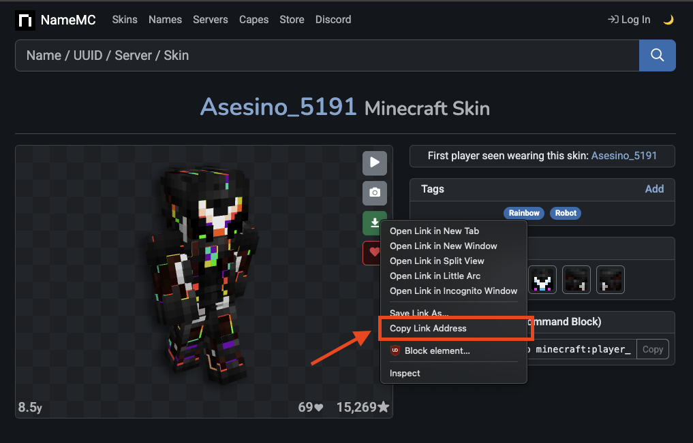

# FAQ

### Does FancyNpcs support Shopkeepers?

- There is no official integration or addon for Shopkeepers
- But you can use the "/shopkeeper remote" as console_command actions
- Example `/npc action MY_NPC any_click add console_command shopkeeper remote SHOPKEEPER_ID {player}`
- SHOPKEEPER_ID: the display name of the shopkeeper

### Does FancyNpcs support ModelEngine 4?

No, currently there is no support for ModelEngine 4 or any other model engine. Since this is a highly requested feature, it might be added in the future (no promises or estimates). Keep an eye on the discord server for updates.

### Can I make the npc move?

FancyNpcs does not have a movement system yet. This is a highly requested feature and might be added in the future. Keep an eye on the discord server for updates.

We already made plans for a waypoint system, but it is not yet implemented. If you have any suggestions or ideas, feel free to share them on the discord server.

### Placeholders as skin

Using placeholders as skin does generally work. There are a few requirements tho:
- The placeholder must resolve into a valid username, UUID, URL or file path
- The placeholder must be able to resolve without any player context

You can test if this is the case by trying to manually resolve the placeholder using the `/papi parse --null %YOUR-PLACEHOLDER%` command. 
If the placeholder resolves to a valid value, you can use it as skin.

### URLs as skin

You can use URLs as skin. There are a few requirements tho:

- The URL must be reachable
- The URL must point to a valid skin file
- Using a URL that points to a .png file is recommended

How to use a skin from NameMC:

